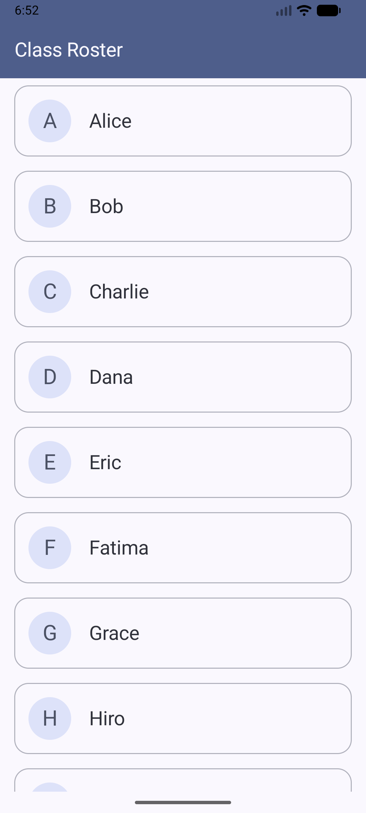

# CS501midterm_Q3
# Question 3: Lazy Lists

## Description

This task implements a scrollable list of student names using Jetpack Compose. The screen displays a list of 20 students using a `LazyColumn`, ensuring efficient rendering and smooth scrolling.

---

## Screenshot



This screenshot shows the scrollable list of student names displayed using a LazyColumn.

---

## Implementation Details

### Data Source

* A list of 20 student names is defined inside the composable:

  ```kotlin
  val students = listOf(
      "Alice","Bob","Charlie","Dana","Eric",
      "Fatima","Grace","Hiro","Isabel","Jack",
      "Karen","Luis","Maya","Nate","Olivia",
      "Priya","Quinn","Ravi","Sara","Tom"
  )
  ```

### LazyColumn Implementation

* The list is displayed using `LazyColumn`
* The `items()` DSL is used to efficiently render each student:

  ```kotlin
  items(students) { student ->
      StudentCard(name = student)
  }
  ```

### UI Design

* Each student name is displayed inside an `OutlinedCard`
* A custom `StudentCard` composable is created for better structure
* Each card includes:

  * A circular avatar showing the first letter of the name
  * The full student name
* The list is fully scrollable and responsive

---

## Key Features Implemented

* Use of `LazyColumn` for efficient list rendering
* Use of `items()` DSL
* Display of 20 student names
* Each item shown inside a styled card
* Smooth scrolling behavior
* Clean and modular UI design

---

## Conclusion

This implementation demonstrates how to efficiently display lists in Jetpack Compose using LazyColumn. It follows best practices for performance and UI structuring while keeping the design clean and user-friendly.

---

## AI Usage Disclosure

* **Tool Used:** ChatGPT
* **How it was used:** Assisted in writing the README and fixing small bugs/issues
* **Extent of Use:** Used only for support; all implementation was done independently

---
